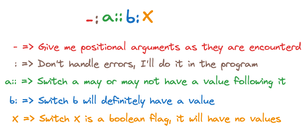

# GetOpt

!!!!! getopt does not work as expected in C++20 on MacOS !!!!!

[Ref](https://azrael.digipen.edu/~mmead/www/Courses/CS180/getopt.html)

If I don't want getopt to manage the error conditions, I need to prefix the option string with a `:`. If I do this, getopt will return with a `?` for unknown options and `:` for options that are missing values.



## Options
### Value Options
These are specified with the switch character followed by a `:`, e.g., `a:` means that the switch `-a` will be followed by one argument.

### Multivalue Options
There is no explicit support in getopt for this. It is left upto the user code to parse the string that getopt provides.

```shell
findme -p 2,3,4
findme -p "2 3 4"
```
Or use any other separator.

### Multiple Options
This is supported by default. When parsing the CLI, getopt will just return the option and its value every time it encounters them.

### Counting
Not supported.

### Boolean Flags
A switch that is true if provided and is considered false if not provided is the most basic use case in getopt. The option is simply provided by the single switch character, e.g., `a:b` means that `-a` will be followed by a value (as mentioned above), but `-b` will just be a switch which is either there or not. 

### Value or Boolean
It is possible for a switch to have a value following it or not. This is supported by appending the switch character with double colons `a::`. But the value will have to follow the switch without any spaces.

```shell
myexe -a  # this is ok
myexe -afoo  # this means that a has value foo
myexe -a foo  # foo is not considered the value of a.
```

### Feature Flags
No explicit support, but user can implement it easily enough.

### Choice Options
No explicit support, but user can implement it easily enough.

### Prompts
Not supported.

## Arguments
All the positional arguments are collected after all the options have been parsed. The arguments are collected in order. There is no special option string that I need to provide for this.

```shell
gcc -Wall -Wextra main.c foo.c bar.c -O -o mainexe -ansi -pedantic -Werror
```

Here `main.c`, `foo.c`, `bar.c`, and `mainexe` are all collected after all the options have been parsed. So I don't know if `main.c` came after `-Wextra` and so on. If I don't want this behavior, but would rather handle the argument as it is recieved, I need to prefix my option string with a `-`. E.g., `-a:b`.
