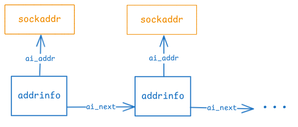
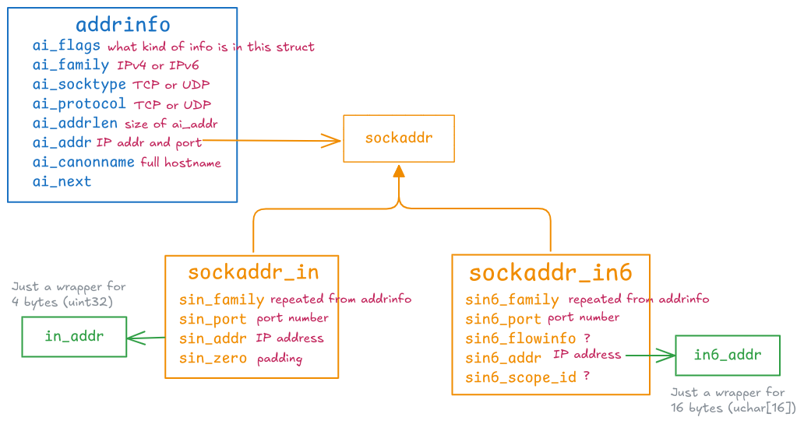

# Networking Notes

Common IP address ranges -

| IP Range                                             | Usage                                           |
| ---------------------------------------------------- | ----------------------------------------------- |
| `10.x.x.x` with `0 <= x <= 255`                      | Private networks                                |
| `172.y.x.x` with `16 <= y <= 31` and `0 <= x <= 255` | Private networks                                |
| `192.0.2.x` with `0 <= x <= 255`                     | Make-believe "real" IP for use in documentation |
| `192.168.x.x` with `0 <= x <= 255`                   | Private networks                                |

## Error Reporting & Return Values

All the networking APIs rely on the return value to indicate error. A return value of $-1$ indicates an error and the `errno` variable is set. For APIs that conceptually need to return an int, like the ones that return a socket file descriptor, the return value will be a positive number. For APIs that conceptually don't return anything, a return value of $0$ will indicate success.

## Big-Endian and Little-Endian

Network byte order is big-endian - how we normally write numbers. E.g., in the number $123$ the most significant (aka the biggest) digit is $1$ and it is written first, i.e., we start with the big end first. Intel chips follow the little-endian format where the least significant digit (bit) is written first, so $123$ would be written as $321$. The following functions convert numbers from host to network byte order and vice-versa. For chipsets that already follow big-endian, these are no-op functions.

| Function  | Description                                                  |
| --------- | ------------------------------------------------------------ |
| `htons()` | host to network  ~~short~~ `uint32`- converts 2 bytes integer from host to network byte order. Even though the name has `short` in it, the actual api will work with any 16 bit integer. |
| `htonl()` | host to network ~~long~~ - converts 4 bytes integer from host to network byte order. Even though the name has `long` in it, the actual api will work with any 32 bit integer. |
| `ntohs()` | network to host 16 bit integer.                              |
| `ntol()`  | network to host 32 bit integer.                              |

There are no builtin functions to convert 64 bit integers.

## Address Info

| Struct                | API                                                 | Description                                                  |
| --------------------- | --------------------------------------------------- | ------------------------------------------------------------ |
| `struct addrinfo`     | `getaddrinfo()`, `freeaddrinfo()`, `gai_strerror()` | The main structure containing the socket information.        |
| `struct sockaddr`     | Binary placeholder for IPv4 or IPv6 address.        | This is usually cast to a more specific struct and then used. |
| `struct sockaddr_in`  | `ntohs()` and `inet_ntop()`                         | IPv4 address and port.                                       |
| `struct sockaddr_in6` | `noths()` and `inet_ntop()`                         | IPv6 address and port.                                       |


The central struct is the `struct addrinfo` which contains socket info like the type of connection (socket type), the IP protocol (IPv4 or IPv6), the IP address, and the port number. Usually this is not filled in by hand, we use the `getaddrinfo` API to look up hostnames or service names and get back a filled in `addrinfo`. The actual socket info is in a linked structure called `struct sockaddr`. 



```c
int getaddrinfo(
    const char *restrict node,
	const char *restrict service,
	const struct addrinfo *restrict hints,
	struct addrinfo **restrict res
);
```

`node` is usually the hostname like "www.microsoft.com". `service` see below. The `hints` is where I can supply my query parameters, `res` is the filled in struct that I get back.

There is a corresponding `freeaddrinfo` that will deep free the struct. Everything in this struct is network byte order. I can convert the error code of `getaddrinfo` with the `gai_strerror()` API.

IPv4 addresses use `sockaddr_in` and IPv6 use `sockaddr_in6`. Both of these can be cast back-and-forth with `sockaddr`. There is another struct called `sockaddr_storage` which is supposed to be large enough to hold both types of address. It seems that if I want to be IPv4 or IPv6 agnostic I should use `sockaddr_storage`.

I can use the `ntohs()` function to access the port. And the `inet_ntop()` for network-to-presentation format of the address (there is a corresponding `inet_pton()` function to convert a human readable string to a network order IP address). This function takes in a `void*` for the address so I can pass in either IPv4 or IPv6 address to get the human readable address out.

Conceptually, this API returns the `addrinfo` but it is done as an out-param.

> This does not strictly follow the rule for error reporting and return value described in the section above. It still returns $0$ for success, but for failure it returns a bunch of integers defined as error codes.



### Flags

This is used in the hints to request a particular information. This is a bitmask that can be ORed. All the flags are defined in `netdb.h`. The most common flag is `AI_PASSIVE` which is used when creating a server socket that will be bound to the host. This tells the OS to bind the IP of the host.

### Socket Type

This shows up as `addrinfo.socktype`, where I can specify what kind of socket I want. The three main types are `SOCK_STREAM`, `SOCK_DGRAM`, and `SOCK_RAW` for TCP, UDP, and ? type of connections. The along with a few others are defined in `socket_type.h`. 

### Protocol

This shows up as `addrinfo.protocol`. I can specify what protocol I want as a hint or get the protocol associated with the retrieved `addrinfo`. This taken from the `/etc/protocols` file which has 138 protocols on my current laptop running Arch Garuda Linux.

### Family

This shows up in a lot of places. There are 50 different families defined in `socket.h` but for the most part I'll use `AF_INET` or `AF_INET6`. The `AF` stands for address family. When used in context of sockets, use `PF_INET` and `PF_INET6`. The `PF` stands for protocol family. These are literally defined as aliases of each other. There is some legacy reason for why there are two names.

### Service

This shows up in the `getaddrinfo` API. This can be a port number, like “80”, or the name of a particular service (found in [The IANA Port List](https://www.iana.org/assignments/port-numbers)[20](https://beej.us/guide/bgnet/html/#fn20) or the `/etc/services` file on your Unix machine) like “http” or “ftp” or “telnet” or “smtp” or whatever.

## Socket

```c
int socket(int domain, int type, int protocol);
```

Once I have a filled in `addrinfo`, I can create a socket (which is just a file descriptor) with the `socket()` api. I don't need the IP address or the port just yet. Conceptually this call returns a valid (strictly?) positive integer representing the socket file descriptor.

```c
struct addrinfo* res;
getaddrinfo("www.microsoft.com", "http", &hints, &res);

int sockfd = socket(res->ai_family, res->ai_socktype, res->ai_protocol)
```

## Server Socket

### Bind

Once I have the socket, I can bind this socket to a specific address (combination of IP address and port). This is usually done for server sockets. `ai_addr` contains both the IP address and port. Conceptually this call returns nothing. 

```c
int bind(
    int sockfd, 
    const struct sockaddr *addr,
    socklen_t addrlen
);
```

```c
bind(sockfd, res->ai_addr, res->ai_addrlen);
```

To get rid of the "Address already in use" use the `SO_REUSEADDR` sockopt like so -

```c
int yes = 1;
setsockopt(sockfd, SOL_SOCKET, SO_REUSEADDR, &yes, sizeof yes);
```

Conceptually this call does not return anything.

==TODO: It is not clear whether I should call this before or after bind. It makes sense before, but I need to check it out.==

After the call to `bind` the socket is ready to use.

### Listen & Accept

```c
int listen(int socket, int backlog);
```

This is a fairly straightforward call, it puts the socket in an "listening" mode. `backlog` the number of incoming connections. Conceptually it returns nothing.

```c
int accept(
	int sockfd,
    struct sockaddr* restrict address,
    socklen_t* restrict address_len
);
```

`accept` accepts the queued up connection. If there are none, then it will block until there is a new client connection. The signature is the same as `bind` and `connect`.  The difference is that the socket address it gets is the new dedicated socket that the OS created for this particular connection. Think of this as the data-plane socket. Up until now we were dealing with control plane sockets. This call has two return values, the new `sockaddr` which is an out param, and the new socket file descriptor which is the actual return value. The `sockaddr` is more for informational purposes for streaming sockets, the actual comms will happen with the returned socket fd. For datagram sockets, the `sockaddr` is also needed in addition to the socket fd.

The sequence of setting up a server is -

```
1. getaddrinfo()
2. socket()
3. bind()
4. listen()
5. accept
```

## Client Socket

### Connect

This is the equivalent of `bind` but for client side connections. Both have an identical signature.

```c
int connect(
    int socket, 
    const struct sockaddr *address,
    socklen_t address_len
);
```

```c
connect(sockfd, res->ai_addr, res->ai_addrlen);
```

The call does not have any conceptual return value. The sockfd being used is the data-plane socket. There is no control-plane socket here.

## Communicate

### Blocking

```c
int send(
	int socket,
    const void* buffer,
    size_t length,
    int flags
);

ssize_t recv(
    int socket, 
    void* buffer, 
    size_t length, 
    int flags
);
```

The socket being used is the data-plan socket. The rest of the params are self-explanatory. `send` returns the actual bytes sent, which might be less than message length. So any return value that is strictly positive is a successful call. `recv` returns the number of bytes received, `ssize_t` is typedefed to some sort of integer type. But `recv` can return $0$ to indicate a closed connection. Stream sockets - both server and client use these APIs. Client datagram sockets can also use these APIs.

```c
ssize_t sendto(
	int socket,
    const void* message,
    size_t length,
    int flags,
    const struct sockaddr* dest_addr,
    socklen_t dest_len
);

ssize_t recvfrom(
	int socket,
    void* restrict buffer,
    size_t length,
    int flags,
    struct sockaddr* restrict address,
    socklen_t* restrict address_len
);
```

`sendto` has the `sockaddr` as an input, `recvfrom` has `sockaddr` as an out param that can then be used to `sendto` data. These APIs are only used for datagram server connections.

```c
int close(int fd);
int shutdown(int sockfd, int how);
```

`close` can be used to close any file descriptor including sockets. It does not return anything. For most purposes it is enough. `shutdown` is used when I want more control over how the connection will be closed.

### Multiplexing

Typically the server has a lot of incoming client connections. Blocking on each client until they have sent something is not feasible. The basic idea behind multiplexing is to make reads non-blocking and then monitor all connected sockets for any incoming activity. For sockets that have activity, handle the incoming data (or new connections). Then loop. The `poll()` function is used for this. It accepts an array of socket fds and blocks until there is activity on any of the sockets. Here is the excerpt from my "CPPNotes.md" -

---

A common pattern in networking is to monitor a bunch of fds and sleep until at least one of them is ready to use. `poll()` is used for this.

```c
int poll(struct pollfd fds[], nfds_t nfds, int timeout);
```

I pass a bunch of fds that I want to monitor to the `poll()` function along with a timeout value. This call will block until one of the fds is ready. If no fds are ready, then the poll will return after timeout milliseconds. The `pollfd` struct is used to specify what kind of events I want to monitor for. It also serves as an outparam wherein the events that actually did occur are specified when the call returns.

```c
struct pollfd {
    int fd;
    short events;  // specify what events to monitor for
    short revents;  // contains events that actually occured
};
```

The events are bitmasks constructed using bitwise-|. The two most common events are `POLLIN` and `POLLOUT` for when the fd is ready to read and write respectively.

See `poll_demo.c` for a full example.

---

The main server loop will look something like this -

```C
for(;;) {
    int num_ready = poll(fds, count, -1);  // don't block if nobody is ready
    for (int i = 0; i < count; i++) {
        if (fds[i].revents & POLLIN) {
            // This socket has some activity
            // if this is the server socket accept the incoming connx
            int new_conn = accept(server_sock, ...);
            // add this new_conn to the list of fds
            
            // if this is the client socket read the incoming data
            char buf[1024];
            long numbytes = recv(fds[i].fd, buf, sizeof(buf), 0);
        }
    }
}
```

See "multiplex".


